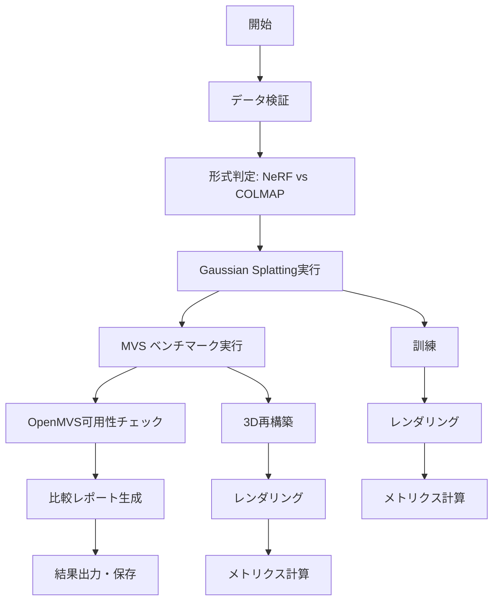

# run_comparison.py 詳細解析ドキュメント

## 概要

`run_comparison.py`は、**Gaussian Splatting**（3D Neural Rendering）と**MVS（Multi-View Stereo）**ベンチマークの包括的な性能比較を行うオーケストレーションスクリプトです。小惑星Ryuguの3D再構築研究において、2つの異なる3D再構築手法の品質と性能を定量的に評価するために設計されています。

## 主要機能

### 1. データ形式の自動検出・検証
- **NeRF形式**: `colmap/` + `images/` + `transforms_test.json`
- **COLMAP形式**: `sparse/0/` + `Input/` + バイナリファイル群
- 入力データの構造を自動判定し、適切な処理パイプラインを選択

### 2. Gaussian Splattingパイプライン実行
- 神経ネットワークベースの3D再構築・レンダリング手法
- 訓練、レンダリング、品質評価の完全自動化

### 3. MVSベンチマークパイプライン実行
- 従来の3D再構築手法（OpenMVSベース）
- メッシュ生成、テクスチャリング、レンダリング、評価

### 4. 包括的比較分析
- 実行時間、メモリ使用量、品質メトリクスの定量比較
- 結果の可視化とレポート生成

## クラス構造

### ComparisonBenchmark クラス

メインのオーケストレーションクラスで、以下の責務を持ちます：

```python
class ComparisonBenchmark:
    def __init__(self, data_path, output_dir, gs_dir)
    def validate_input_data()           # データ形式検証
    def run_gaussian_splatting_pipeline()  # GSパイプライン実行
    def run_mvs_benchmark_pipeline()       # MVSパイプライン実行
    def generate_comparison_report()       # 比較レポート生成
```

## 詳細機能解析

### データ検証機能 (`validate_input_data`)

**NeRF形式の検証**:
- `colmap/`: COLMAP sparse reconstruction
- `images/`: 入力画像ディレクトリ
- `transforms_test.json`: テストカメラポーズ

**COLMAP形式の検証**:
- `sparse/0/` または `sparse/`: 疎再構築データ
  - `cameras.bin`, `images.bin`, `points3D.bin`
- 画像ディレクトリの優先順位:
  1. `images/` (RGB/RGBA画像優先)
  2. `images/Input/` (ネストした構造)
  3. `Input/` (グレースケール画像の可能性)

### Gaussian Splattingパイプライン (`run_gaussian_splatting_pipeline`)

**Phase 1: 訓練 (train.py)**
```bash
python train.py -s <data_path> -m <model_path> 
    --resolution 2        # VRAM節約のため画像解像度削減
    --data_device cpu     # 画像をCPUメモリに保存
    [--eval]             # データ形式に応じて評価モード有効化
    [--images <rel_path>] # COLMAP形式時の画像パス指定
```

**メモリ最適化**:
- システムRAM < 16GBの場合、`--sh_degree 2`を追加
- psutilによる自動メモリ検出

**Phase 2: レンダリング (render.py)**
```bash
python render.py -m <model_path>
```

**Phase 3: メトリクス計算 (metrics.py)**
```bash
python metrics.py -m <model_path>
```
- PSNR, SSIM, LPIPSを計算
- `results.json`に結果保存

### エラー診断機能 (`diagnose_gaussian_splatting_error`)

詳細なエラー分析と解決提案：

1. **シーンタイプ認識エラー**: データ形式やパス解決の問題
2. **仮想メモリ不足**: Windowsページファイル設定の提案
3. **GPU メモリ不足**: CUDA OOM エラーの対処法
4. **ライブラリ読み込みエラー**: CUDA/cuDNNの設定問題
5. **ファイル不存在エラー**: データ構造の問題

### MVSベンチマークパイプライン (`run_mvs_benchmark_pipeline`)

**Phase 1: OpenMVS可用性チェック**
```bash
# 必要ツール: DensifyPointCloud, ReconstructMesh, TextureMesh
```

**Phase 2: MVS 3D再構築**
```bash
python mvs_benchmark/run_mvs.py -s <data_path> -o <output_dir>
```

**Phase 3: 新規視点レンダリング**
```bash
python mvs_benchmark/render_mvs.py -m <mesh_file> -t <transforms_test.json> -o <render_dir>
```

**Phase 4: メトリクス計算**
```bash
python mvs_benchmark/metrics_mvs.py -r <rendered_dir> -g <gt_dir> -o <metrics.json>
```

### 比較レポート生成 (`generate_comparison_report`)

**比較項目**:
1. **実行時間**: 各パイプラインの総実行時間
2. **メモリ使用量**: ピークメモリ消費量（MVSのみ追跡）
3. **品質メトリクス**:
   - **PSNR** (Peak Signal-to-Noise Ratio): 高いほど良い
   - **SSIM** (Structural Similarity Index): 高いほど良い  
   - **LPIPS** (Learned Perceptual Image Patch Similarity): 低いほど良い

**結果出力**:
- コンソールでの比較テーブル表示
- `comparison_results.json`への詳細結果保存

## 実行フロー



## 使用例

```bash
# 基本実行
python run_comparison.py -s ./data_input/nerf_blender_qiita

# 出力ディレクトリ指定
python run_comparison.py -s ./data_input/nerf_blender_qiita -o ./comparison_results

# Gaussian Splattingディレクトリ手動指定
python run_comparison.py -s ./data_input/nerf_blender_qiita --gaussian-splatting-dir ./gaussian-splatting
```

## エラーハンドリングの特徴

1. **リアルタイム出力表示**: 長時間実行されるコマンドの進捗をリアルタイム監視
2. **詳細エラー診断**: 一般的な問題に対する具体的解決策提案
3. **グレースフルフォールバック**: OpenMVS未インストール時のスキップ処理
4. **実行時間測定**: 各フェーズの詳細なタイミング情報

## 科学研究での位置づけ

このスクリプトは、**小惑星Ryugu**の3D再構築という特定の科学研究コンテキストで：

- **Neural rendering vs 従来手法**の定量比較
- **天文学的観測データ**（視野条件、位相角）の考慮
- **高精度3Dモデル**の品質評価
- **計算資源効率性**の評価

を目的として設計されています。

## 出力ファイル構造

```
comparison_output/
├── gaussian_splatting/
│   └── model/              # 訓練済みGSモデル
│       ├── point_cloud.ply
│       ├── cameras.json
│       └── results.json    # GSメトリクス
├── mvs_benchmark/
│   ├── scene_textured.obj  # テクスチャ付きメッシュ
│   ├── rendered_images/    # レンダリング画像
│   ├── benchmark_stats.json
│   └── metrics.json        # MVSメトリクス
└── comparison_results.json # 包括的比較結果
```

## まとめ

`run_comparison.py`は、現代的な神経レンダリング手法と従来の3D再構築手法を科学的に比較するための、高度に自動化された包括的ベンチマークシステムです。エラーハンドリング、性能監視、結果分析まで含む完全なオーケストレーションツールとして機能します。